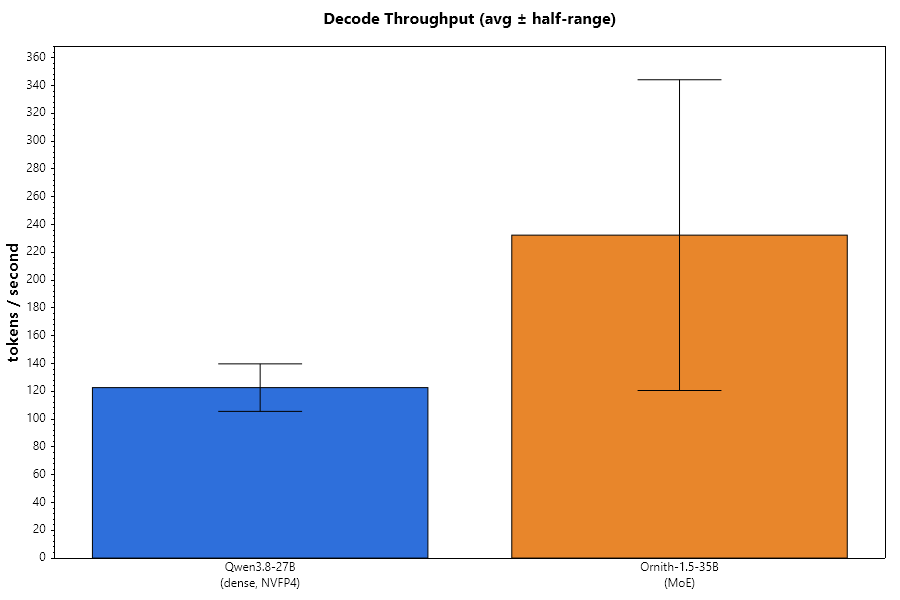
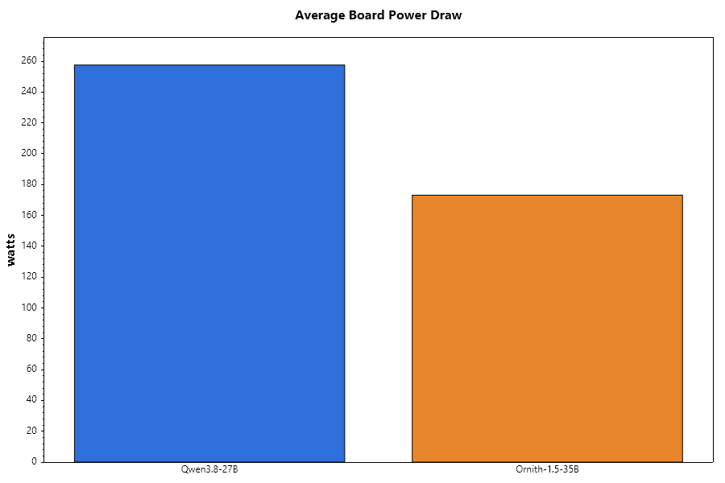
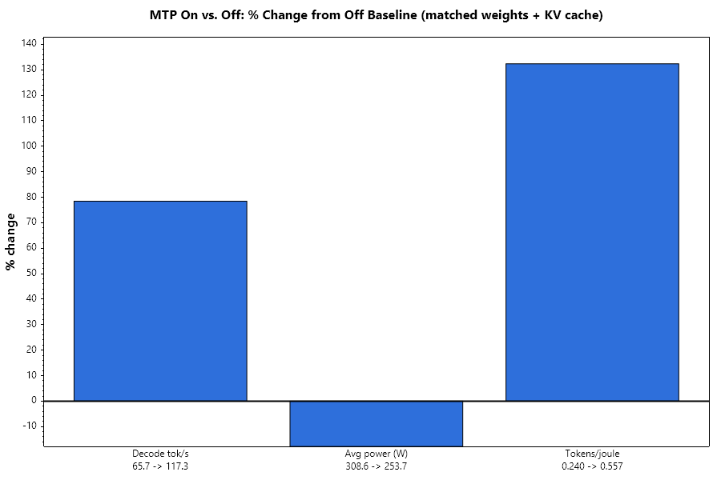
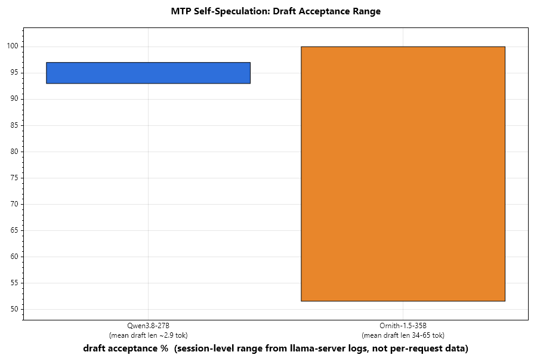
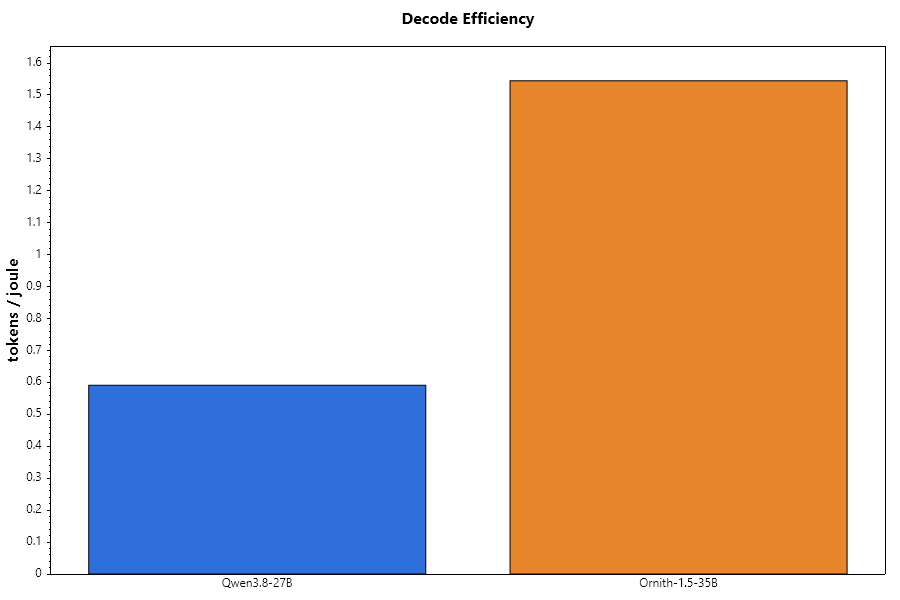
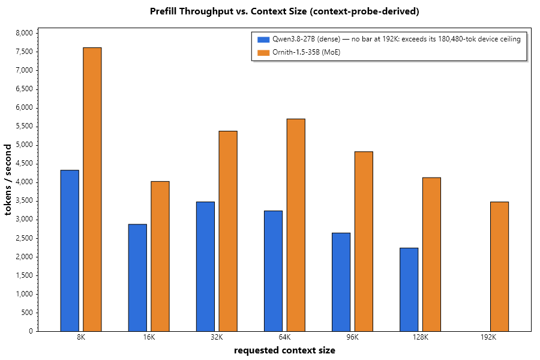
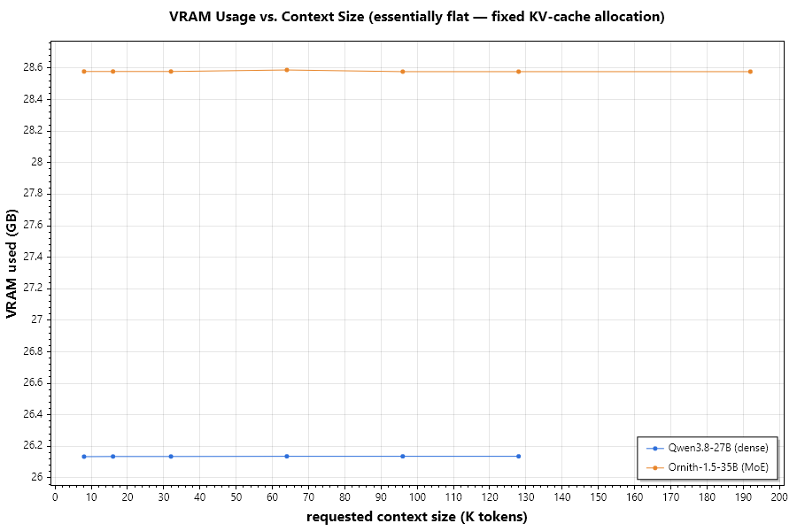
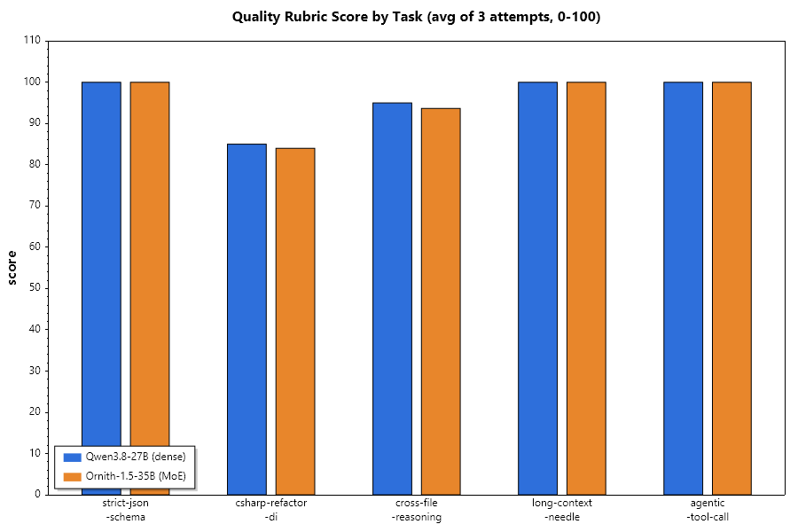
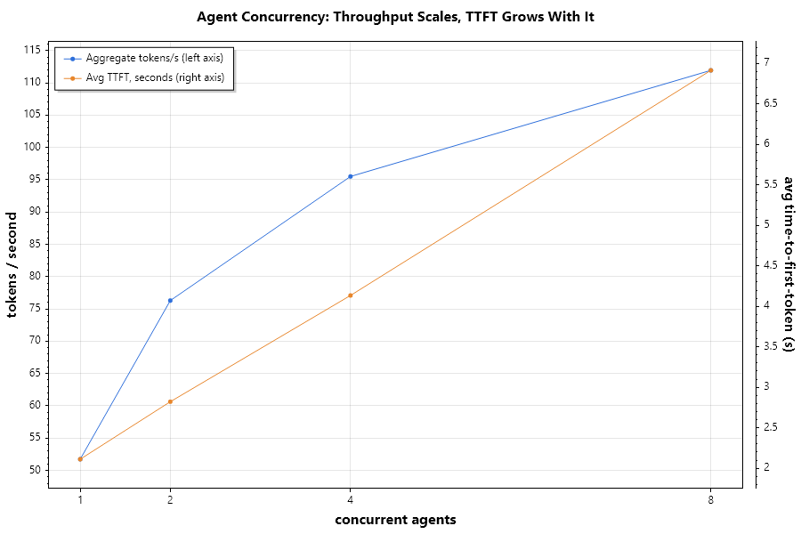
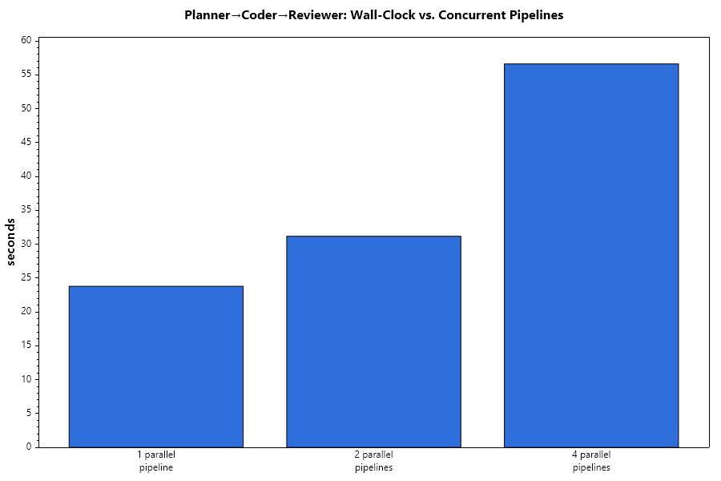

# NVFP4 on Blackwell: What a Dense 27B and an MoE 35B Actually Do on an RTX 5090

*Benchmarking two local LLMs on Windows + llama.cpp, in the spirit of
[pankaj uvāca's Qwen 3.8 / MLX piece](https://medium.com/@pankaj-uvacha/benchmarking-qwen-3-8-7c21d7817718)
— same "which should I actually run" question, this time on CUDA / Blackwell.*

## TL;DR

- **NVFP4 on a 5090 pushes a dense 27B model to ~123 tok/s** at full board power (257 W
  avg) — solid, but not the headline.
- **MTP is worth +78% decode throughput, 2.3× the tokens/joule, and costs ~25% of your
  context ceiling** — a real, matched before/after, once I found the actual lever. On by
  default with no HTTP-reachable control otherwise, and its draft-acceptance rate — the
  thing that determines how much of that +78% you actually get — swings with the serving
  stack's own state, not just the model.
- **The MoE model wins on every speed and efficiency axis** (1.9× decode tok/s, 2.6×
  tokens/joule, 45% more usable context, even generously corrected) — and once I caught
  and fixed a real inconsistency in my own grading, quality between it and the dense
  NVFP4 model is a wash (96.0 vs 95.5, not the 97-vs-95 gap I originally reported).
  **Still the default I'd recommend, including for agentic coding** — but look past the
  average for one narrow flag: on the single task that actually separated all three
  configurations — give back a complete, compiling artifact, not a sketch of one — a
  third model I'd only added as a quant-format control, Qwen3.8-27B UD-Q4_K_M, was the
  clean winner (97.0 vs 85.0 and 84.0). Three attempts on one task isn't enough to
  override the speed gap, but it's enough to test that exact pattern before you trust
  either model on it.
- **Agent workflows don't need a "no batching" caveat anymore.** Concurrent agent load and
  a 3-stage Planner→Coder→Reviewer pipeline both scale sub-linearly and predictably on this
  card — the numbers are in Finding #4.

## Lineup & Test Setup

Two primary models, plus a third run specifically to check whether the dense-vs-MoE
comparison actually isolates architecture (see Finding #3 — it doesn't, on its own):

| | Qwen3.8-27B NVFP4 | Ornith-1.5-35B-A3B | Qwen3.8-27B UD-Q4_K_M |
|---|---|---|---|
| Architecture | Dense | MoE (~3B active params) | Dense (same weights as NVFP4 entry) |
| Quant | NVFP4 (native FP4) | Q4_K_M | UD-Q4_K_M (k-quant) |
| Repo | `esatapedico/Qwen3.8-27B-NVFP4-MTP-GGUF` | `ornith-ai/Ornith-1.5-35B-A3B-GGUF` | `unsloth/Qwen3.8-27B-GGUF` |
| Speculative decoding | Built-in MTP head, always on | Built-in, also always on (see Finding #2) | Built-in, also always on |
| Role | Primary NVFP4 subject | Primary MoE subject | Quant-format control (Finding #3 only) |

Both served through **Unsloth v0.1.808-beta** (package 2026.9.4, bundled
**llama.cpp b10909-mix-bea84f7**, `http://localhost:8888/v1`, OpenAI-compatible),
measured with a purpose-built C# benchmark harness that streams every response to capture
time-to-first-token, sustained tokens/s, VRAM before/after, and board power via
`nvidia-smi` polled every 500 ms. Five coding-focused tasks × 3 repeats × each model,
plus a context-length probe, an agent-concurrency load test, and a 3-stage multi-agent
workflow benchmark run through Microsoft Agent Framework — the full battery, run
identically for all three models (the third on a separate day). Zero errors across every run.

**Rig:** RTX 5090, 32 GB GDDR7, driver 616.64, power limit 600 W (the card's max — no
headroom left, so these are its ceiling numbers, not a conservative slice of them), PCIe
Gen5 x16, resizable BAR on. CUDA 13.0 (Unsloth's reported toolkit version; the driver's
UMD reports 13.4 — a driver-vs-toolkit distinction, not a mismatch to worry about).
AMD Ryzen 9 9950X3D
(16C/32T), 64 GB DDR5-4800, ASUS PRIME X870-P WIFI, Windows 11. Full methodology and
exact sampling parameters are in the footer.

## Finding #1 — The NVFP4 Baseline

Qwen3.8-27B in native FP4 sustained **122.6 tok/s average** across the full speed pass
(106.3–140.5 tok/s range), pulling 257.5 W average board power (109–429 W range across
individual requests, peaking at 503 W) at 26.1 GB VRAM. That's a dense 27-billion-parameter
model, at FP4, comfortably inside a 32 GB card with room to spare.

The wide power range within a single model is worth pausing on: idle-to-loaded swings of
this size on a fixed power limit usually mean the workload isn't compute-bound the whole
time — which sets up Finding #2.

## Finding #2 — What MTP Actually Buys You (a Real Before/After)

Every earlier draft of this piece said some version of "there's no way to turn MTP off,
only Studio's GUI has a switch, and it doesn't apply per-request" — I'd assumed the
OpenAI-compatible API was the only lever available and left it there. It isn't. Unsloth
ships a CLI (`unsloth studio run`) that launches the exact same server type the GUI does,
and it takes `--speculative-type off|mtp|...` directly, plus (via flag passthrough to
llama-server) `--cache-type-k`/`--cache-type-v` for KV cache precision. That's a real,
scriptable, *recordable* control — not a GUI click nothing logs. So I closed Studio,
launched the same weights twice — once with the drafter off, once with it on, identical
`f16` KV cache and identical tasks/sampling both times — and ran the full speed pass and a
context probe against each.

| | MTP off | MTP on | Effect |
|---|---|---|---|
| Decode tok/s avg | 65.7 | **117.3** | **+78%** |
| Avg board power | 308.6 W | **253.7 W** | MTP uses *less* power |
| Tokens/joule | 0.240 | **0.557** | **2.32× more efficient** |
| Context ceiling (f16 KV) | **92,672 tok** | 69,120 tok | off is ~25% higher |

That's the real shape of the trade. MTP doesn't just make this card faster — verifying
several draft tokens in one batched forward pass is more compute-efficient per output
token than decoding them one at a time, so it draws *less* power while producing *more*
tokens, over 2× the tokens per joule. The cost is context: the draft/NextN sidecar has
its own VRAM footprint, which eats into what would otherwise be KV cache, so the same
32 GB card fits about a quarter less context with the drafter on. Draft acceptance on
this exact matched run sat at 70.7–100%, mean draft length 2.41–3.00 tokens.

None of this is free to get, though, which is worth being honest about. Every Studio
session before this one had the drafter on by default with no way to see or set it short
of finding the CLI — and once it's on, it isn't a fixed multiplier. This run's own draft
acceptance ranged 70.7–100% depending on the request; an earlier session on the same
model saw 7.8–79.2% acceptance with 6–49-token mean draft lengths, a much noisier and
less favorable picture, for reasons I never pinned down (something in Studio's own
defaults, not anything I changed). **Ornith self-speculates too** — I'd initially assumed
otherwise — with acceptance ranging 51.6–100% and mean draft lengths of 34–65 tokens, far
longer chains than Qwen's ~2.9-token drafts. That's the actual explanation for Ornith's
wide tok/s spread in Finding #3, not model instability.

So: MTP is a real, large, efficiency-positive effect when you can isolate it — and also a
moving target session to session when you can't. Both things are true, and a benchmark
that only reports one of them is incomplete.

## Finding #3 — Dense vs. MoE Under a 32 GB Ceiling

This is the comparison the setup was built for: a dense 27B model against a
1.5-trillion-parameter-class MoE with ~3B active parameters, both squeezed under the same
32 GB card.

| Metric | Qwen3.8-27B (dense, NVFP4) | Ornith-1.5-35B-A3B (MoE) |
|---|---|---|
| Decode tok/s (avg / range) | 122.6 / 106.3–140.5 | **232.4** / 187.0–410.6 |
| Avg board power | 257.5 W | **173.1 W** |
| VRAM used | 26.1 GB | 28.5 GB |
| Tokens/joule | 0.591 | **1.544** (2.6×) |
| Context ceiling (device-fit) | 180,480 tok | **262,144 tok** (full native) |
| Quality (rubric avg, 0–100) | 96.0 | 95.5 |

Ornith wins every efficiency axis by a wide margin: nearly double the throughput at two
thirds the power, and a context ceiling 45% higher — it fits its full native 262K context
on this card, where the dense model tops out at 180K before the server refuses to load
more. Prefill throughput (measured from the context probe, which amortizes fixed
per-request overhead better than the short speed-pass prompts do) tells the same story:
Ornith ran 1.4–2.3× Qwen's prefill tok/s across matched context sizes, from 8K tokens all
the way to 128K.

**But that table isn't quant-controlled**, and I don't want to gloss over that: it's NVFP4
against Q4_K_M, so architecture and quant format are both changing at once. Ornith has no
usable NVFP4 release for this stack — the official `ornith-ai/Ornith-1.5-35B-A3B-NVFP4`
is safetensors-only, built for vLLM/SGLang, no GGUF files at all — so I couldn't match
quant format on the MoE side. What I could do: run the *dense* model a second time at
`unsloth/Qwen3.8-27B-GGUF:UD-Q4_K_M`, a standard k-quant instead of NVFP4, same
architecture. That isolates the quant-format effect from the architecture effect.

First pass at that table used whatever KV cache dtype Studio's GUI happened to have set
for each model — which I hadn't checked, because I didn't yet know that mattered or that
it was visible anywhere. It turned out to be `q8_0` for UD-Q4_K_M (confirmed from
Studio's own Run Settings panel), and unknown for the NVFP4 side. So that first
"quant-controlled" table wasn't actually quant-controlled either — it had a second,
invisible variable stacked on the one I was trying to isolate. Once I'd found the CLI
lever for Finding #2's MTP test, the fix was obvious: use it here too.
`unsloth studio run --cache-type-k f16 --cache-type-v f16 --speculative-type mtp` on both
weights, recorded, not inferred from a GUI screenshot.

| | Qwen NVFP4 (f16 KV) | Qwen UD-Q4_K_M (f16 KV) |
|---|---|---|
| Decode tok/s avg | 117.3 | 130.3 |
| Avg power | 253.7 W | 281.0 W |
| Tokens/joule | 0.557 | 0.590 |
| Context ceiling | 69,120 tok | 85,248 tok |
| Prefill tok/s, 8K→64K | 4362→2158 | 3400→1750 |

Two things held up: prefill throughput still shows a clean, consistent NVFP4 edge
(~1.20–1.28× at every size, whether KV cache is matched or not — genuinely a quant-format
effect, not an artifact), and UD-Q4_K_M is still marginally the faster decoder, still very
likely MTP draft-acceptance noise rather than a quant effect (decode speed isn't touched
by KV cache dtype the way prefill and context capacity are). **Two things flipped
outright.** Tokens/joule: the first pass had NVFP4 about 9% ahead; matched, UD-Q4_K_M is
about 6% ahead instead. Context ceiling: the first pass had NVFP4 24% higher; matched,
UD-Q4_K_M is 23% higher instead. Both directions reversed. The absolute numbers moved a
lot too — NVFP4's own context ceiling went from 180,480 (unknown KV, almost certainly
quantized) to 69,120 (explicit f16) — which is mostly telling you how much a KV-cache
choice alone is worth on this card, not anything about the model.

I'm not going to redo the Ornith comparison here, because it would give a false sense of
precision: Ornith's own KV cache dtype during its run is still unknown, so "Ornith vs
Qwen" stays a comparison with one uncontrolled side no matter which Qwen number I plug
in. What I can say cleanly is the part that's now actually isolated — NVFP4 wins prefill,
loses tokens/joule and context ceiling, to a standard k-quant on identical weights — and
that a claim I nearly published ("controlling for quant format widens the MoE's
advantage") was built on a comparison that wasn't controlled for the thing it claimed to
control for. It's out of this draft for that reason, not because it was necessarily
wrong — because I don't know, and saying so is more honest than a plausible-sounding number.

Quality was the one place I'd originally reported Qwen ahead, and it doesn't survive
scrutiny. Grading the UD-Q4_K_M transcripts for this bridge run surfaced a real
inconsistency in my own rubric: all three of its `csharp-refactor-di` attempts stub the
concrete repository/sender classes with `throw new NotImplementedException();` — the
exact thing I'd docked Ornith 12 points for as "dropping working logic." Except the
prompt never showed those classes' bodies in the first place, so there was no logic to
drop for *either* model. Worse, going back to check Qwen NVFP4's own DI response (which
I'd scored 90 with no deduction): its placeholder method bodies are `{ /* ... */ }` on a
method that returns `Order` — no `return`, no `throw`. That doesn't compile. I'd
penalized Ornith for a construct that runs, and missed a compile error in the model I was
scoring higher. Corrected: Qwen NVFP4's DI score drops 90→85, Ornith's weakest DI attempt
rises 78→88. Full arithmetic in `docs/quality-rubric.md`.

What's left standing: Ornith did give a bare two-line DI excerpt instead of the requested
full `Program.cs` on two of its three attempts — that's a real, narrow completeness gap,
just not the broader "drops real logic" story I originally told. Once corrected, the
5-task averages are **96.0 (Qwen NVFP4) vs 95.5 (Ornith)** — a wash, well inside the noise
of a 5-task/3-repeat manual grade.

If what you actually care about is agentic coding rather than the aggregate, though,
don't stop at the average — look at the one task that actually separated the three
configurations, because it's the shape of failure that matters most in an agent loop: an
incomplete or subtly-broken artifact that gets acted on before anyone reviews it.
Per-task, `csharp-refactor-di` is the only place real daylight opens up — **97.0
(UD-Q4_K_M) vs 85.0 (Qwen NVFP4) vs 84.0 (Ornith)** — everything else across all three
configurations is 93.7–100. UD-Q4_K_M is the one that got that specific task fully
right, every attempt: a complete, compiling artifact, the actual requested `Program.cs`
shape, no shortcuts. It started this piece as a quant-format control, not a contender —
and on the one axis where the three configurations actually differ, it's the strongest
of them. I checked whether this generalizes with a sixth task in a different domain
(extend a working bash script, preserve every existing behavior, output the complete
file) — all three scored a clean 100/100, so it isn't a general reliability edge, it's
specific to this exact failure shape (stubbed-but-uncompiling bodies, or an excerpt
instead of the literal complete file). But "give me the complete, correct artifact when
I ask for one" is close to the core competency an agentic-coding loop depends on, and on
that one test, one config did it cleanly and the other two didn't — that's worth more
than its 1-point contribution to a 5-task average suggests.

Worth being direct about what that quality edge is actually worth, though, because I'd
only ever put UD-Q4_K_M up against NVFP4 (the quant-format control it was built for) —
never against Ornith, the model it would actually have to beat to matter.

| | UD-Q4_K_M | Ornith | Ornith's edge |
|---|---|---|---|
| Decode tok/s | 130.3 | **232.4** | 1.78× |
| Avg power | 281.0 W | **173.1 W** | uses 62% of the power |
| Tokens/joule | 0.590 | **1.544** | 2.62× |
| Context ceiling | 85,248 tok* | **262,144 tok** | 3.08× (*see below) |
| Quality (5-task avg) | **98.6** | 95.5 | UD-Q4_K_M +3.1, driven by 1 task |

That context number needs a caveat I should have made earlier: 85,248 is UD-Q4_K_M
running the same forced `f16` KV cache I used everywhere in this section to isolate the
quant-format effect — nobody would actually deploy it that way. A quantized KV cache
(`q8_0`, Studio's own default, barely touches output quality) got this exact quant to
~145,920 tokens earlier in this project; a realistic deployable range is more like
140–180K, not 85K. Correct for that and Ornith's context lead shrinks to something like
1.5–1.9×, not 3×. It still wins.

So: **no, this isn't a reason to prioritize UD-Q4_K_M.** Ornith wins decode speed,
power, efficiency, and context by wide margins, even generously corrected. Giving that
up for a quality edge built on three attempts at one task is the wrong trade for a
general workload. What the finding actually earns is narrower: if your agentic workload
leans hard on "extract and wire up the complete thing" — interfaces, DI registration,
anything shaped like handing back a whole file rather than a diff — that specific
pattern is worth testing with more than three attempts before you trust either model on
it in production, independent of which one you pick as your default.

## Finding #4 — Agent Workloads Scale, They Don't Fall Over

This is the piece a static single-prompt benchmark won't show you: what happens when an
agent framework actually hammers the server.

**Concurrent identical agents** (same prompt, N running at once, Qwen model): aggregate
throughput climbed from 51.7 tok/s at 1 agent to 111.9 tok/s at 8 — sub-linear, as expected
for a memory-bandwidth-bound card, but a real and useful batching win, not a flat line.
Average time-to-first-token grew alongside it (roughly 2.1s → 6.9s from 1 to 8 agents),
which is the honest cost of that batching benefit.

**A 3-stage Planner → Coder → Reviewer pipeline**, run as 1, 2, and 4 concurrent pipeline
instances: a single pipeline finished in ~23.8s; four running at once averaged ~57.7s —
each doubling of concurrent pipeline load cost roughly +30–80% wall-clock, not the +100%
you'd see if the server serialized everything. For anyone building multi-agent workflows
against a local server instead of a hosted API, that's the number that actually matters:
this card doesn't cliff-dive under agentic load, it degrades gracefully.

## Bottom Line

This started as a quant-and-architecture benchmark, but the question I actually care
about is narrower: which of these do you point an agentic coding setup at?

**The MoE model is the default I'd actually recommend**, including for agentic coding.
It wins decode speed (1.78–1.9×), power efficiency (2.6× tokens/joule), and context
capacity by wide margins over both dense configurations — margins wide enough to survive
generous correction (UD-Q4_K_M's context number, run under a deliberately uncompressed
KV cache to isolate a different variable, would realistically be ~140–180K deployed
normally, not the 85K it shows here; Ornith still leads even then). And once graded
consistently, the aggregate quality gap between it and the dense NVFP4 model isn't real.

The one thing worth carrying forward isn't "switch models" — it's a narrower flag. On
the single rubric task that actually separated all three configurations — extract an
interface, refactor to constructor injection, hand back the literal registration code —
**Qwen3.8-27B UD-Q4_K_M**, a model I only added as a quant-format control, got it right
every attempt while Qwen NVFP4 shipped a placeholder that doesn't compile and Ornith
handed back a bare excerpt twice out of three. That's three attempts on one task, not
enough to override a 1.78×/2.6× speed-and-efficiency gap — but if your agentic workload
leans hard on "give me the complete file, not a sketch of one," test that exact pattern
with a real sample size before trusting whichever model you land on, independent of
which one you pick as your default. Everything else in this rubric — tool-calling,
structured extraction, long-context retrieval — was a clean 100/100 across all three
configurations, so the choice there comes down cleanly to speed and efficiency, where
the MoE model wins outright.

Either way: MTP is worth turning on — +78% decode, less power, 2.3× the efficiency, for
about a quarter of your context ceiling — but don't take a vendor's "always-on
speculative decoding" throughput number at face value without checking draft-acceptance
logs; the multiplier you actually get on any given request is a property of that
request, not a fixed spec, and if the GUI is the only place you can see or set it, find
the CLI instead — it's there, it's scriptable, and it's the difference between assuming
and knowing. And don't take a dense-vs-MoE comparison at face value either unless quant
format is controlled for — mine wasn't, until I checked.

And if you're building anything agentic rather than single-shot: benchmark it agentic.
The concurrency and pipeline numbers here look nothing like what a single-prompt
speed test would have predicted, and that gap is exactly where a lot of local-LLM
capacity planning goes wrong.

## Methodology

- **Tool**: a purpose-built C# benchmark harness (open-sourced alongside this piece),
  streaming every completion to capture true TTFT rather than relying on
  request-level timers.
- **Sampling**: deterministic params fixed across both models and all tasks — see
  `config.article.json` in the repo for the exact values (temperature, top-p, top-k,
  min-p, repetition penalty).
- **NVFP4 quantization** (`esatapedico/Qwen3.8-27B-NVFP4-MTP-GGUF:Qwen3.8-27B-NVFP4-MTP-HIGH`
  — note the full quant tag, not the shorter `:HIGH` alias the repo used earlier; that
  alias stopped resolving between benchmark sessions): converted from
  [unsloth/Qwen3.8-27B-NVFP4](https://huggingface.co/unsloth/Qwen3.8-27B-NVFP4) (itself
  quantized from base `Qwen/Qwen3.8-27B` using Unsloth's "Dynamic V3.0" quantizer), then
  repackaged to GGUF: NVFP4 (4-bit) on MLP layers 0–55, F8 on layers 56–63 — so this is a
  mixed-precision quant, not uniform 4-bit throughout. F8 tensors were dequantized to BF16
  before GGUF conversion (`convert_hf_to_gguf.py --outtype auto`, then `llama-quantize
  --tensor-type-file` for the HIGH-tier override map); NVFP4 tensors carry through as
  native GGML type 40. Requires an NVFP4-CUDA-kernel llama.cpp build with `sm_120`
  (Blackwell) support and the `draft-mtp` spec path — satisfied here by Unsloth's
  bundled b10909-mix-bea84f7 (the repo's own compatibility note references an older
  community-tested commit, b10434). **Not documented by either model card**: the
  calibration dataset and block size used for the original NVFP4 quantization — noting
  that gap rather than guessing at it.
- **Speed pass**: 5 coding-focused tasks × 3 repeats × 2 primary models = 30 requests,
  plus the same 5×3 = 15 requests against the UD-Q4_K_M quant-format control. Zero
  failures across all 45.
- **Quant-format control**: run as a separate session (2026-09-15) after the two primary
  models. First attempt hung mid-run — a different local harness loaded/unloaded a model
  on the same Unsloth instance while a benchmark request was in flight, and the
  request never got a response. Stopped it, confirmed the server was idle, reran clean.
  Don't drive the same local inference server from two tools at once mid-benchmark. That
  first pass's KV cache dtype (`q8_0`, confirmed from Studio's own Run Settings panel)
  turned out to be an unrecorded second variable — superseded the same day by a rerun
  with KV cache explicit and matched (`--cache-type-k f16 --cache-type-v f16`, same
  method as the MTP on/off control below) on both sides; the numbers in Finding #3 are
  from that matched rerun, not the original pass. Ornith's own KV cache dtype during its
  run is still unrecorded — the Ornith-vs-Qwen comparison wasn't re-run and isn't claimed
  to be fully controlled.
- **MTP on/off control**: `unsloth studio run --speculative-type off|mtp
  --cache-type-k f16 --cache-type-v f16` (Unsloth's CLI server launcher, not the GUI),
  same weights both times, GUI closed first to free the port. Confirmed off via the
  absence of a `common_speculative_init_result` line in llama-server's own log at model
  load (and its presence when set to `mtp`); a first attempt at `-ctv f16` got mangled by
  Unsloth's arg parser into the invalid flag `-ct` and failed to load — the long-form
  `--cache-type-v` worked. 5-task × 3-repeat speed pass + 4-step context probe run against
  each state.
- **Context probe**: progressively larger prompts with a unique nonce per step (so
  prefix-KV-cache reuse can't inflate the result) until the server fails or hits its
  device-fit ceiling.
- **Power**: `nvidia-smi --query-gpu=power.draw,...` polled every 500 ms for the duration
  of each request; tokens/joule = completion tokens ÷ (avg watts × generation seconds).
- **Quality**: manual rubric grading (not an LLM-judge) against a written pass/fail
  criteria per task, scored 0–100, by hand. 30 transcripts from the two primary models'
  full run, 6 from the bash-script-extend generalization check, and 15 from the
  UD-Q4_K_M quant-format control — 51 scored responses total. Grading the third model's
  transcripts surfaced a real scoring inconsistency in the original DI-task grades (see
  Finding #3) — corrected and documented in `docs/quality-rubric.md`'s "Regrade"
  section, along with all 51 scores in `results/quality-scores.csv`.
- **Agent tests**: run through Microsoft Agent Framework against the same server,
  measuring aggregate tok/s under N-way concurrent identical agents, and wall-clock
  scaling of a 3-stage sequential agent pipeline run at 1/2/4-way concurrency.
- **Caveat**: speed-pass prefill-tokens/s is overhead-dominated at short prompt sizes
  (~2.1s fixed TTFT regardless of prompt length under ~300 tokens) and isn't a meaningful
  prefill-throughput number at that scale — the context-probe-derived numbers in Finding #3
  are the ones to trust for prefill throughput.
- Every number here is a snapshot of one serving stack's state on one day — draft
  acceptance rates and context ceilings both visibly drifted between sessions on this
  same box (see Finding #2). Re-verify before citing "the" number for a given model.
